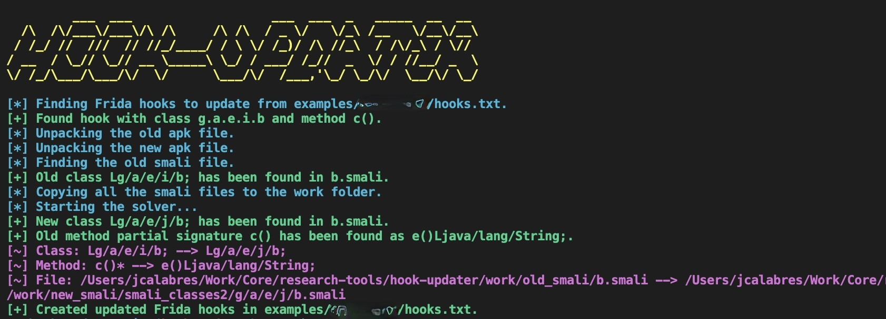

```java
            ___  ___                   ___  ___  _   _____  __  __  
      /\  /\/___\/___\/\ /\     /\ /\  / _ \/   \/_\ /__   \/__\/__\ 
     / /_/ //  ///  // //_/____/ / \ \/ /_)/ /\ //_\\  / /\/_\ / \// 
    / __  / \_// \_// __ \_____\ \_/ / ___/ /_//  _  \/ / //__/ _  \ 
    \/ /_/\___/\___/\/  \/      \___/\/  /___,'\_/ \_/\/  \__/\/ \_/                                                     
    for Android          
```
Did you created any Frida hooks with the Java API and the app has been updated being unable to use them again? 

With this tool, you will be able to update your non-functional Frida hooks to a new ones in only a few minutes!

It's provided as a solution that intends to update hooks between the same application and slightly different versions e.g. applications with minor update differences and low/mid levels of obfuscation.

# Table of Contents
1. [Features](#features)
2. [Requirements](#requirements)
3. [Setup](#setup)
4. [Usage](#usage)
5. [Examples](#examples)
6. [How it works?](#how-it-works)
7. [Metrics](#metrics)
8. [What's next?](#whats-next)
9. [Contributing](#contributing)

# Features

* Generates an updated Frida hooks file.  
* Updates hooks of applications with low/mid levels of obfuscation. 
* All non-standard API hooks are updated.
* Compatibility with the most common OS.

# Requirements

* *Apktool*
* *Python3*

# Setup

## MacOS:
```
brew install apktool
```

## Windows:
```bash
choco install apktool
```

## Linux: 

Follow this instructions from the [apktool](https://ibotpeaches.github.io/Apktool/install/) website.

# Usage

```python
updater.py [-h] -old OLD -new NEW -hooks HOOKS -out OUT
```

# Examples

You can execute the tool with the following parameters:

```
python3 updater.py -old examples/*****/7.4.1.46567.apk -new examples/*****/7.5.0.46863.apk  -hooks examples/*****/hooks.js -out examples/*****/updated_hooks.js
```
An example of execution:



If the solver has found the new classes and methods, a summary with the new classes and methods will be shown.

# How it works?

The user specifies two different APKs for the same application. It also specifies the old hooks file and the new hooks file paths. Then, the solver of the tool will try to find similarities between the old smali files and the new smali files from the updated APK. 

The application uses multiple metrics and a score system to detect similarities between Java classes and Java methods that are in the Smali format.

>Smali is a languaje created for representing decompiled Android bytecodes and it can be obtained using the original [baksmali](https://github.com/JesusFreke/smali) tool or using other tools that have integrated it such as apktool or jadx.

We can summarize the behaviour of this tool in different stages.

## Stage 1 - Unpacking APKs

The application unpacks the APKs into a work directory. 

## Stage 2 - Finding the old smali files

The application find all the classes specified in the configuration file and copies all the smali files that contain these classes into a the work directory.

## Stage 3 - Finding the new smali files

The application finds similarities between the specified classes and all the smali files that are inside the new provided APK. Whenever the tool finds these classes, it will copy the smali files into the work folder. Check [Class finder metrics](#class-finder-metrics) for more information.

## Stage 4 - Finding the new methods

The application will find similarities between the specified methods and the methods inside the found smali files using multiple metrics. Check [Method-finder-metrics](#class-finder-metrics) for more information.

## Stage 5 - Solver results

The results obtained will be written into the new hook file.

# Metrics

## Class finder metrics

The metrics used to find the new classes in a smali file are:

* Number of fields.
* Similarities between fields.
* Number of methods. 
* Similarities between methods.
* Similarities between method signatures.

## Method finder metrics

* Similarities between signatures.
* Similarities between Smali lines of code.

# What's next?

* Add support to dump application's DEX files in runtime.
* Improve class finder and method finder metrics.
* Code refactoring, make clean code.

# Contributing

Pull requests and issues are welcome to this repository.